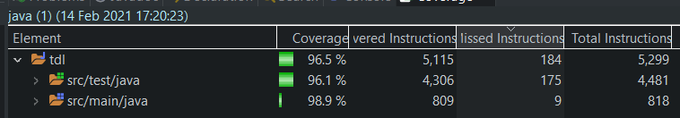
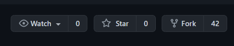
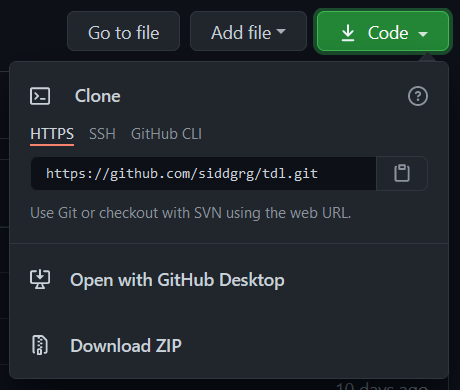
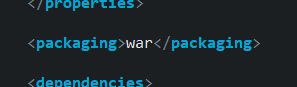
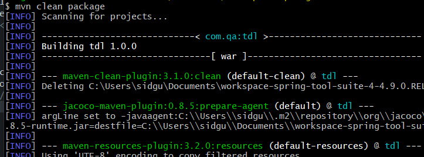
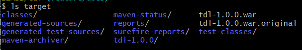

Coverage: 98.9% on src/main/java

# To-Do List (TDL)

A CRUD web application with a Spring Boot backend and a Bootstrap-based frontend. The database comprises of two tables called Tasks and Assignees, as well as an intermediary table named Tasks_Assignees, created to handle the many-to-many relationship between Items and Orders.

## Getting Started

These instructions will get you a copy of the project up and running on your local machine for development and testing purposes. See deployment for notes on how to deploy the project on a live system.

### Prerequisites

[JDK 8 or over](https://www.oracle.com/java/technologies/javase-jre8-downloads.html)

[Maven](http://maven.apache.org/download.cgi)

[Spring Boot](https://spring.io/quickstart)

[Bootstrap 5](https://getbootstrap.com/)

[Git](https://git-scm.com/downloads)

#### Dependencies (already added to the pom.xml):

Spring Data JPA

Validation

H2 Database

Spring Web

Spring Fox

[Model Mapper](http://modelmapper.org/getting-started/)

[Selenium](https://robotframework.org/SeleniumLibrary/)

### Installing

To create a copy of this repository in to your local machine:

1. Fork this repository to your account

2. Using Git Bash, clone it to your local machine to a directory of your choosing

3. Open the repo using your chosen IDE

5. The project is now ready for development and testing!

## Running the tests

Testing of this program was done using unit. Unit testing is a software testing method that isolates individual units of the software, and validates whether each of them performs as designed. These units are considered to be the smallest testable parts of an application. JUnit and Mockito were used to write the tests.

To deploy tests using Maven, simply run `mvn clean test` in the root directory of your local repository.

## Deployment

To create a self-contained executable WAR using Maven:

1. Make sure the following `<packaging>` element is in your `pom.xml` file:

2. Open the directory containing the repository in a terminal
3. Run `mvn clean package`

3. If all tests pass and no hiccups occur, the WAR file should be located in the target folder.

## Built With

* [Java 8](https://www.oracle.com/java/)
* [Maven](https://maven.apache.org/) - Dependency Management
* [MySQL](https://www.mysql.com/) - RDBMS
* [Git](https://git-scm.com/) - Version Control System
* [JUnit](https://junit.org/junit4/) & [Mockito](https://site.mockito.org/) - Testing
* [Jira](https://www.atlassian.com/software/jira) - Project Management
* [GCP](https://cloud.google.com/) - Database Host

## Authors

* **Siddhartha Gurung** (qasidd)

## License

This project is licensed under the MIT license - see the [LICENSE.md](LICENSE.md) file for details 

## Acknowledgments

* Team Trap
* Alan
* Vinesh
* Aswene
* Nick
